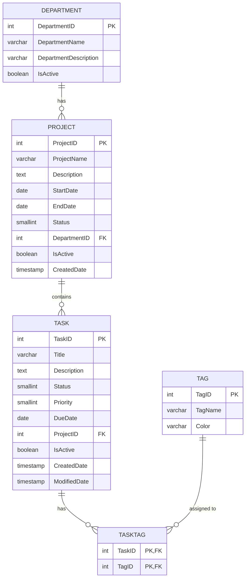

# TaskTrack — Task & Team Management Frontend (PRN232 Assignment 1)

Modern, responsive web application for managing Departments, Projects, and Tasks with Next.js 14 App Router, TypeScript, and Tailwind CSS, connecting to ASP.NET Core Web API 8.

---

## 🚀 Features

- **Public Access (No Authentication Required)**: Seamless access to all browsing and management features.
- **Home Dashboard (`/`)**:
  - Welcome banner with overview of the application.
  - Summary statistics for active Departments, Projects, and Tasks.
  - Responsive project cards with quick links to project details.
- **Departments (`/departments` & `/departments/[id]`)**:
  - Browse active departments with search by name.
  - Inspect department details and associated projects.
- **Projects (`/projects/[id]`)**:
  - View project details, timeline, department link, and project status badge.
  - Filter tasks inside the project by status (All, To Do, In Progress, Done, Cancelled).
- **Tasks (`/tasks/[id]` & `/search`)**:
  - Comprehensive task details including title, description, project, priority badge, status badge, timestamps, and colored tag pills.
  - Multi-criteria real-time search filtering by keyword, status, priority, project, and tag.
- **Full CRUD Management**:
  - **Department Management (`/departments/manage`)**: Table with Create, Edit, and Delete modals (safeguards against deleting departments with linked projects).
  - **Project Management (`/projects/manage`)**: Table with Create, Edit, and Delete modals with department dropdown, timeline date validation, and status selection.
  - **Task Management (`/tasks/manage`)**: Table with Create, Edit, and Soft-Delete modals, project assignment, and multi-select tag picker.
  - **Tag Management (`/tags/manage`)**: Table with Create, Edit, and Delete modals featuring custom hex color picker and preset color swatches.
- **UI / UX Enhancements**:
  - Colored status and priority badges (not raw numbers).
  - Toast notification system for instant API success and error feedback.
  - Confirmation modals for all deletion operations.
  - Client-side validation across all forms.
  - Fully responsive design on desktop, tablet, and mobile.

---

## 🗄️ Database ERD Diagram



---

## 🛠️ Tech Stack

- **Framework**: Next.js 14 (App Router)
- **Language**: TypeScript
- **Styling**: Tailwind CSS
- **Icons**: Lucide React
- **Backend**: ASP.NET Core Web API (.NET 8)
- **Database**: PostgreSQL (Entity Framework Core)

---

## 💻 Getting Started

### 1. Prerequisites
- Node.js 18.x or 20.x+
- npm or yarn

### 2. Installation
```bash
cd QE190117_SE19B_Ass1_FE
npm install
```

### 3. Environment Configuration
Copy `.env.example` to `.env.local` and set the backend API endpoint:
```env
NEXT_PUBLIC_API_URL=http://localhost:5117
```

### 4. Running the Development Server
```bash
npm run dev
```
Open [http://localhost:3000](http://localhost:3000) in your browser.

### 5. Production Build
```bash
npm run build
npm run start
```

---

## ☁️ Deployment to Vercel

1. Push this frontend repository to a public GitHub repository.
2. Sign in to [Vercel](https://vercel.com) and import the repository.
3. Configure the Environment Variable in Vercel:
   - `NEXT_PUBLIC_API_URL`: Your live Render backend URL (e.g., `https://your-api.onrender.com`).
4. Click **Deploy**.
